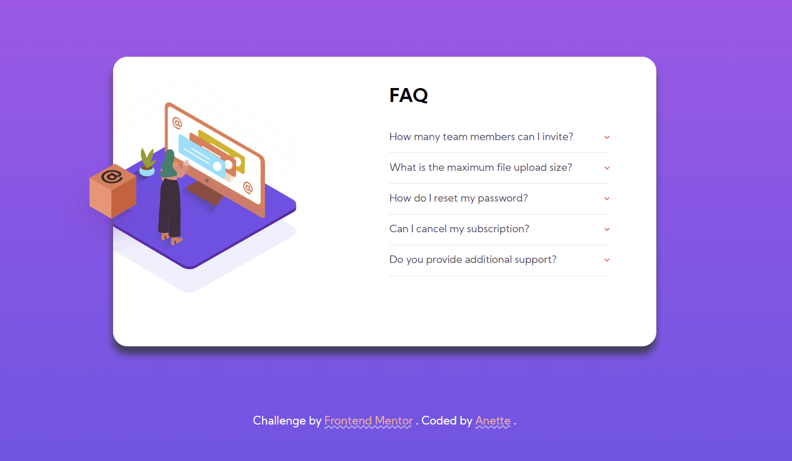

# Frontend Mentor - FAQ accordion card solution

This is a solution to the [FAQ accordion card challenge on Frontend Mentor](https://www.frontendmentor.io/challenges/faq-accordion-card-XlyjD0Oam).

## Table of contents

- [Overview](#overview)
  - [The challenge](#the-challenge)
  - [Screenshot](#screenshot)
  - [Links](#links)
- [My process](#my-process)
  - [Built with](#built-with)
  - [What I learned](#what-i-learned)
- [Author](#author)

## Overview

### The challenge

Users should be able to:

- View the optimal layout for the component depending on their device's screen size
- See hover states for all interactive elements on the page
- Hide/Show the answer to a question when the question is clicked

### Screenshot

### Links

- Solution URL: [Add solution URL here](https://github.com/RedSquirrrel/faq-accordion-card)
- Live Site URL: [Add live site URL here](https://dreamy-benz-63820f.netlify.app/)

## My process

### Built with

- [React](https://reactjs.org/) - JS library
- Flexbox

### What I learned

My goal with this project was to get more comfortable with the react.js library and practicing react hooks, however the CSS part was most challenging 🙂

## Author

- Website - [Add your name here](https://dreamy-benz-63820f.netlify.app/)
- Frontend Mentor - [@RedSquirrrel](https://www.frontendmentor.io/profile/RedSquirrrel)
